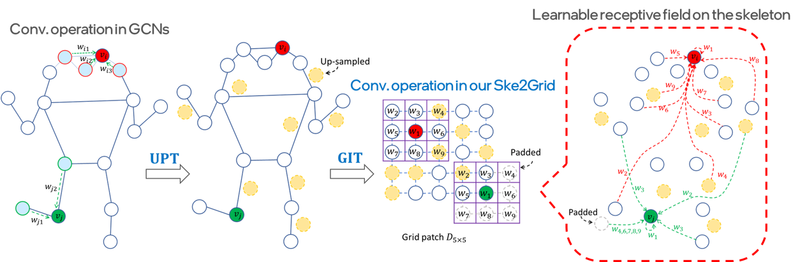
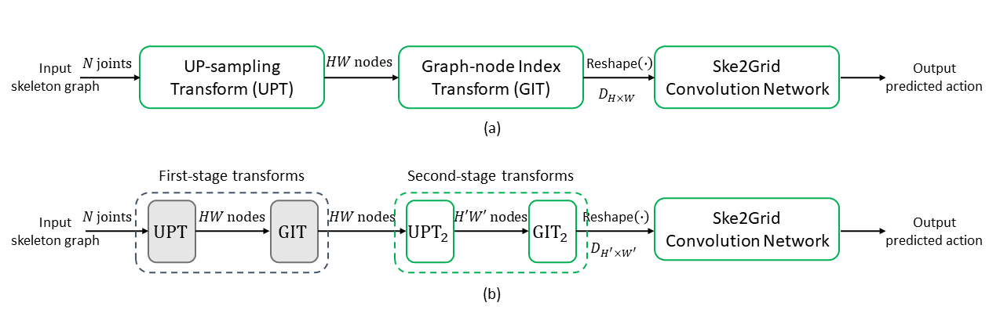

# Ske2Grid: Skeleton-to-Grid Representation Learning for Action Recognition


By [Dongqi Cai](https://dongqicai.github.io/), Yangyuxuan Kang, [Anbang Yao](https://yaoanbang.github.io/) and Yurong Chen.

This repository is an official Pytorch implementation of ["Ske2Grid: Skeleton-to-Grid Representation Learning for Action Recognition"](https://openreview.net/pdf/a0ef5a344fff97a1caaa9861ced153d1113cb84d.pdf),
dubbed Ske2Grid. The paper is accepted to ICML 2023.

## Overview

Ske2Grid, a progressive representation learning framework conditioned on transforming human skeleton graph into an up-sampled grid representation, which is dedicated to skeleton-based human action recognition, showing leading performance on six mainstream benchmarks.

<p align="center"></p>
Comparison of convolution operations in GCNs and in our Ske2Grid. In Ske2Grid, we construct a regular grid patch for skeleton representation via up-sampling transform (UPT) and graph-node index transform (GIT). Convolution operation upon this grid patch convolves every grid cell using a shared regular kernel. It operates on a set of grid cells within a squared sub-patch which may be filled by a set of nodes distributed remotely on the graph, achieving a learnable receptive field on the skeleton for action feature modeling. In the figure, the up-sampled skeleton graph is visualized assuming the locations of the original graph nodes being unchanged for a better illustration.

<p align="center"></p>
(a) The overall framework of Ske2Grid: the input skeleton graph with $N$ joints is converted to a grid patch of size $H\times W$ using a pair of up-sampling transform (UPT) and graph-node index transform (GIT), which is then fed into the Ske2Grid convolution network for action recognition. (b) Ske2Grid with progressive learning strategy (PLS): the input skeleton is converted to a larger grid patch ($H'>H, W'>W$) using two-stage UPT plus GIT pairs. The well-trained Ske2Grid convolution network for the first-stage grid patch as in (a) is re-used to initialize the network for the second-stage grid patch as in (b), and the first-stage UPT plus GIT pair is fixed during training. PLS is used in a cascaded way to boost the performance of our Ske2Grid convolution network with increasing grid patch size.


## Usage

- Download **PYSKL**:
```
git clone https://github.com/kennymckormick/pyskl.git
```
- Prepare datasets following [PYSKL data format](https://github.com/kennymckormick/pyskl/blob/main/tools/data/README.md) or download [the pre-processed 2D or 3D skeletons](https://github.com/kennymckormick/pyskl/blob/main/tools/data/README.md) from PYSKL repository.
- Merge our model and config file folders "**models**", "**utils**" and "**configs**" into the corresponding folders "**pyskl/models**", "**pyskl/utils**" and "**pyskl/configs**" respectively.
- Replace folder "**pyskl/datasets**" with ours "**datasets**" (to avoid mismatch due to PYSKL version update).
- Install **PYSKL** as officially instructed:
```
pip3 install -e .
```


## Models & Results

Results comparison on the NTU-60 XSub validation set.

|  Method  |  Grid Patch Size | Config  |  Top-1 Acc(%) |  Baidu Netdisk  |Log  |
|:---------- |:-------------:|:-------------:|:-------------:|:-------------:|:-------------:|
| ST-GCN | -- | [config](https://pan.baidu.com/s/10UInYDKYUixfehrOPs3xaQ?pwd=8702) | 85.15  | [model](https://pan.baidu.com/s/1qyPg2plsUwaWOlxXuN69bg?pwd=8702)| [log](https://pan.baidu.com/s/1C4i3XRl8uBul76yifcCGVw?pwd=8702) |
| Ske2Grid | 5x5| [config](https://pan.baidu.com/s/19crYKvMmacs8DozrS8uoFg?pwd=8702) | 86.20 | [model](https://pan.baidu.com/s/1T1E3zUivegVoy1Dr4Rdwig?pwd=8702)| [log](https://pan.baidu.com/s/1ZvCa1Q3nl_fHo77_I_eUUw?pwd=8702) |
| Ske2Grid | 6x6| [config](https://pan.baidu.com/s/1bevsfn0HU_IWkOnIVbCNMg?pwd=8702) | 87.87 | [model](https://pan.baidu.com/s/1MziYj5OOP5ErSs3X5X5VgA?pwd=8702)| [log](https://pan.baidu.com/s/1OPQKaFQbjRejWAN9qKvUKQ?pwd=8702) |
| Ske2Grid | 7x7| [config](https://pan.baidu.com/s/1unCcmFfianhlHVzNsPIwEg?pwd=8702) | 88.26 | [model](https://pan.baidu.com/s/1PG2PuVee2Y3DjHlDPyAhSg?pwd=8702)| [log](https://pan.baidu.com/s/1m6XZVHxieqIkLEclHM2cBA?pwd=8702) |
| Ske2Grid | 8x8| [config](https://pan.baidu.com/s/1pnVwi4OT4k7qvjA9iWDzXg?pwd=8702) | 88.55 | [model](https://pan.baidu.com/s/1-jGKCZIyhEap7wQ4vsVgGA?pwd=8702)| [log](https://pan.baidu.com/s/1J_pjDiRgFdQrpFcXEuhevw?pwd=8702) |


## Training & Testing

Training Ske2Grid using grid patch representation of $D_{5\times 5}$:

```
bash tools/dist_train.sh configs/Ske2Grid/d5_stgcn2cn_pyskl_ntu60_xsub_hrnet/j.py 4 --validate
```

Progressively training Ske2Grid of $D_{6\times 6}$ from previous trained Ske2Grid model of $D_{5\times 5}$:
```
bash tools/dist_train.sh configs/Ske2Grid/d5tod6_stgcn2cn_pyskl_ntu60_xsub_hrnet/j.py 4 --validate  --cfg-options load_from='work_dirs/ske2grid/d5_stgcn2cn_pyskl_ntu60_xsub_hrnet/j/best_top1_acc_epoch_*.pth'
```

Evaluating Ske2Grid of grid patch $D_{5\times 5}$:
```
bash tools/dist_test.sh configs/Ske2Grid/d5_stgcn2cn_pyskl_ntu60_xsub_hrnet/j.py work_dirs/ske2grid/d5_stgcn2cn_pyskl_ntu60_xsub_hrnet/j/best_top1_acc_epoch_*.pth 4 --out results_d5.pkl --eval top_k_accuracy mean_class_accuracy
```

## Citation
If you find our work useful in your research, please consider citing:
```
@inproceedings{cai2023ske2grid,
  title={Ske2Grid: Skeleton-to-Grid Representation Learning for Action Recognition},
  author={Cai, Dongqi and Kang, Yangyuxuan and Yao, Anbang and Chen, Yurong},
  booktitle={International Conference on Machine Learning},
  year={2023}
  url={https://openreview.net/forum?id=SQtp4uUByd}
}
```

## License
Ske2Grid is released under the MIT license. We encourage use for both research and commercial purposes, as long as proper attribution is given.

## Acknowledgement
This repository is built based on [PYSKL](https://github.com/kennymckormick/pyskl/tree/main) repository. We thank the authors for releasing their amazing codes.
