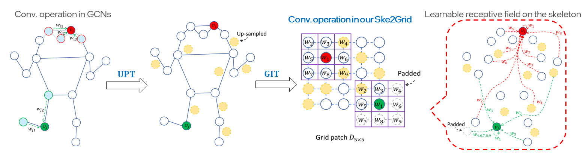

# Ske2Grid: Skeleton-to-Grid Representation Learning for Action Recognition


By Dongqi Cai, Yangyuxuan Kang, [Anbang Yao](https://yaoanbang.github.io/) and Yurong Chen.

This repository is an official Pytorch implementation of ["Ske2Grid: Skeleton-to-Grid Representation Learning for Action Recognition"](https://openreview.net/pdf/a0ef5a344fff97a1caaa9861ced153d1113cb84d.pdf),
dubbed Ske2Grid. The paper is accepted to ICML 2023.

## Overview

Ske2Grid, a progressive representation learning framework conditioned on transforming human skeleton graph into an up-sampled grid representation, which is dedicated to skeleton-based human action recognition, showing leading performance on six mainstream benchmarks.

<p align="center"></p>
Comparison of convolution operations in GCNs and in our Ske2Grid. In Ske2Grid, we construct a regular grid patch for skeleton representation via up-sampling transform (UPT) and graph-node index transform (GIT). Convolution operation upon this grid patch convolves every grid cell using a shared regular kernel. It operates on a set of grid cells within a squared sub-patch which may be filled by a set of nodes distributed remotely on the graph, achieving a learnable receptive field on the skeleton for action feature modeling. In the figure, the up-sampled skeleton graph is visualized assuming the locations of the original graph nodes being unchanged for a better illustration.

<p align="center"></p>
(a) The overall framework of Ske2Grid: the input skeleton graph with $N$ joints is converted to a grid patch of size $H\times W$ using a pair of up-sampling transform (UPT) and graph-node index transform (GIT), which is then fed into the Ske2Grid convolution network for action recognition. (b) Ske2Grid with progressive learning strategy (PLS): the input skeleton is converted to a larger grid patch ($H'>H, W'>W$) using two-stage UPT plus GIT pairs. The well-trained Ske2Grid convolution network for the first-stage grid patch as in (a) is re-used to initialize the network for the second-stage grid patch as in (b), and the first-stage UPT plus GIT pair is fixed during training. PLS is used in a cascaded way to boost the performance of our Ske2Grid convolution network with increasing grid patch size.


## Usage
coming soon

## Models & Results
coming soon

## Training & Testing
coming soon

## Citation
If you find our work useful in your research, please consider citing:
```
@inproceedings{cai2023ske2grid,
  title={Ske2Grid: Skeleton-to-Grid Representation Learning for Action Recognition},
  author={Cai, Dongqi and Kang, Yangyuxuan and Yao, Anbang and Chen, Yurong},
  booktitle={International Conference on Machine Learning},
  year={2023}
  url={https://openreview.net/forum?id=SQtp4uUByd}
}
```

## License
Ske2Grid is released under the MIT license. We encourage use for both research and commercial purposes, as long as proper attribution is given.

## Acknowledgement
This repository is built based on [PYSKL](https://github.com/kennymckormick/pyskl/tree/main) repository. We thank the authors for releasing their amazing codes.
